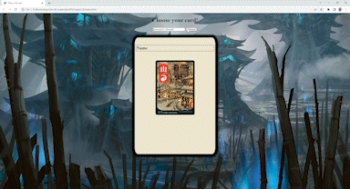
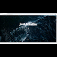

<h1 align="center">Software Engineer in the DMV area</h1>

Creating things is my passion.

From art, knitting, and sewing, to coding. 

Please take a look around.

 

  <a href="https://leonie-middeke.netlify.app/" target="_blank"> <!--portfolio-->
    
  </a>
  <a href="https://www.linkedin.com/in/leonie-middeke" target="_blank"><!--linkedin-->
    
  </a>
  <a href="https://github.com/lmiddeke" target="_blank"><!--github-->
    
  </a>
  <a href="https://twitter.com/le0m22" target="_blank"><!--twitter-->
      
  </a>

 
<h2 align="center">Projects</h2>
<table>
  <tr>
    <!--Barberossa-->
    <td width="50%" valign="top">
      <h3 align="center">Barberossa</h3>
      

      
       
       
        
      
       
         
      
Barberossa is a high-end barbershop. The website shows the services offered, location, and barbers.

      

    </td>
    <!--Magic Card Selector-->
    <td width="50%" valign="top">
      <h3 align="center">Magic2.0</h3>
      

        
       
         
      
      
        
         
      
Are you midway through a Magic round and can't remember what a specific card does that you want to call on? Pull up Magic2.0 to assist you with this task so that you will always look knowledgeable in front of your friends. 

      

    </td>
  </tr>
  
  <tr>
    <!--Breathe-->
    <td width="50%" valign="top">
      <h3 align="center">Breathe</h3>
      

        
       
         
      
      
       
         
      
This is a simple 1 page website designed with Adobe XD.

      

    </td>
    <!--NASA Space API-->
    <td width="50%" valign="top">
      <h3 align="center">Space Images</h3>
      

        
       
         
      
      
       
         
      
Have you ever wished to see the stars but are stuck on earth? Fret not, now you can! Select a date you wish to see a specific space event from NASA, and learn more about it.

      

    </td>
  </tr>  
</table>  

 
<!--Techs-->
<h2 align="center">Technologies</h2>

          

